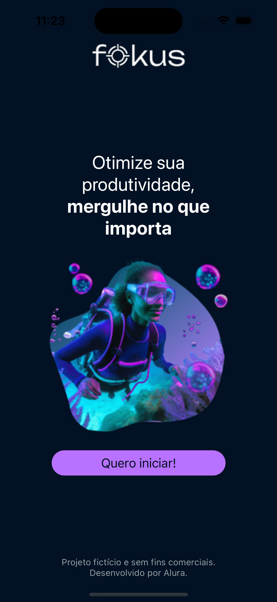

# Projeto Fokus



Aplicativo desenvolvido durante a formação da Alura React Native: Desenvolva seu primeiro app, combinando um timer Pomodoro com uma lista de tarefas integrada.

## 🚀 Funcionalidades

### ⏱️ Timer Pomodoro

- **25 minutos** de foco
- **5 minutos** de pausa curta
- **15 minutos** de pausa longa

### ☑️ Gerenciamento de Tarefas

- **Adicionar** novas tarefas
- **Editar** tarefas existentes
- **Excluir** tarefas
- **Marcar/desmarcar** como concluídas

## 🛠️ Tecnologias Utilizadas

- **React Native** (Framework mobile)
- **Expo** (Plataforma para desenvolvimento)
- **React Navigation** (Navegação entre telas)
- **AsyncStorage** (Armazenamento local)
- **React Native Reanimated** (Animações fluidas)
- **React Native SVG** (Renderização de SVG)

## 📥 Como Executar

### ✅ Pré-requisitos

- Node.js (versão 16 ou superior)
- Expo CLI instalado globalmente (`npm install -g expo-cli`)

### 🔧 Instalação

1. Clone o repositório:
   ```bash
   git clone https://github.com/fernanda-vaz/react-native-fokus.git
   ```
2. Acesse a pasta do projeto
   ```bash
   cd react-native-fokus
   ```
3. Instale as dependências
   ```bash
   npm install
   # ou, se usar Yarn:
   yarn install
   ```
4. Inicie o servidor de desenvolvimento
   ```bash
   expo start
   # ou
   npm start
   # ou
   yarn start
   ```

5. Execute no dispositivo ou emulador
   - 📱 **Dispositivo físico**:
     - Baixe o app **Expo Go** na Play Store ou App Store
     - Escaneie o QR code exibido no terminal
   - 🤖 **Emulador Android**:
     - Tenha o Android Studio instalado e um emulador configurado
     - Pressione `a` no terminal após iniciar o servidor
   - 🍎 **Emulador iOS (apenas Mac)**:
     - Tenha o Xcode instalado
     - Pressione `i` no terminal após iniciar o servidor

## 🛠️ Scripts Úteis

| Comando               | Descrição                          |
|-----------------------|-----------------------------------|
| `expo start`          | Inicia o servidor de desenvolvimento |
| `expo android`        | Executa no emulador Android       |
| `expo ios`            | Executa no emulador iOS (Mac)     |
| `expo run:android`    | Build e execução direta no Android |
| `expo run:ios`        | Build e execução direta no iOS    |

## 📝  Licença
Este projeto foi desenvolvido como parte da formação "React Native: Desenvolva seu primeiro app" da Alura. O código é disponibilizado para fins educacionais.